# NoName

2D strategy and shooter game.

## Dependencies

* Clang++

## run and play

```bash
cd NoName
make
./noName.out
```

## Captures

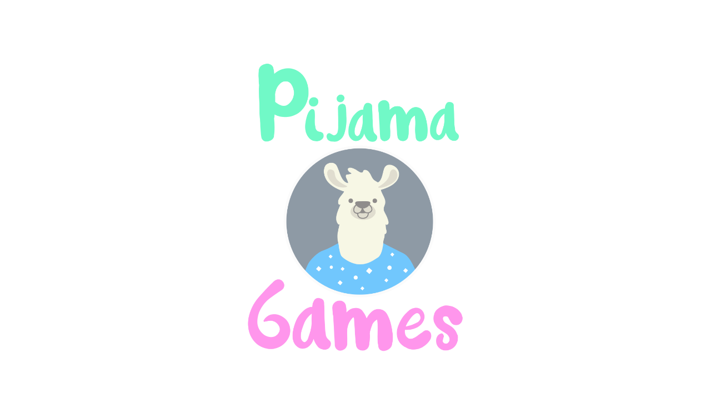

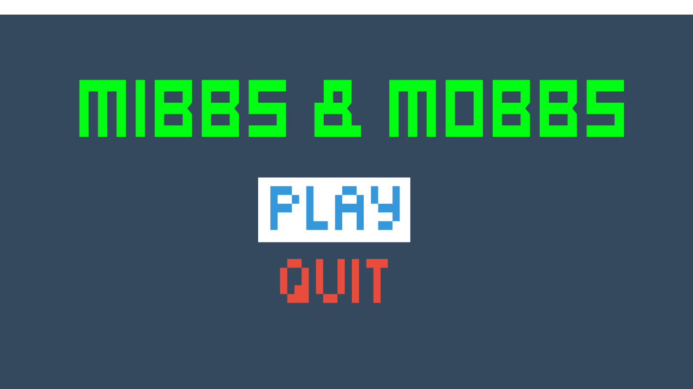
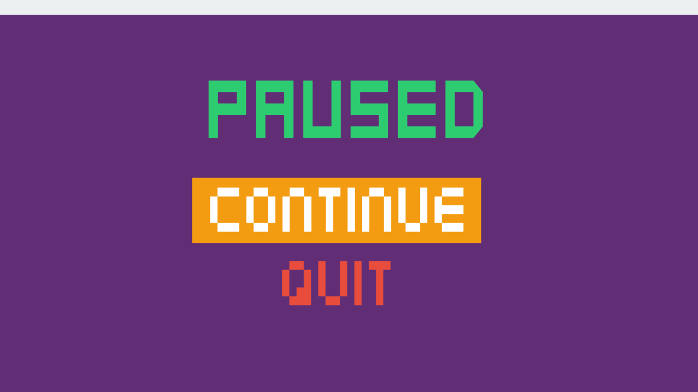

### These plants are crazy...

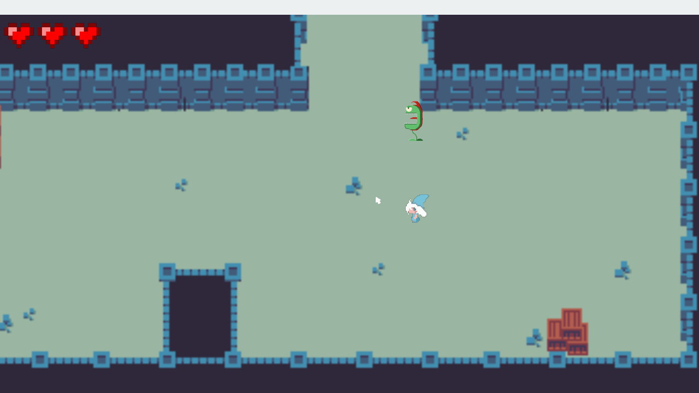
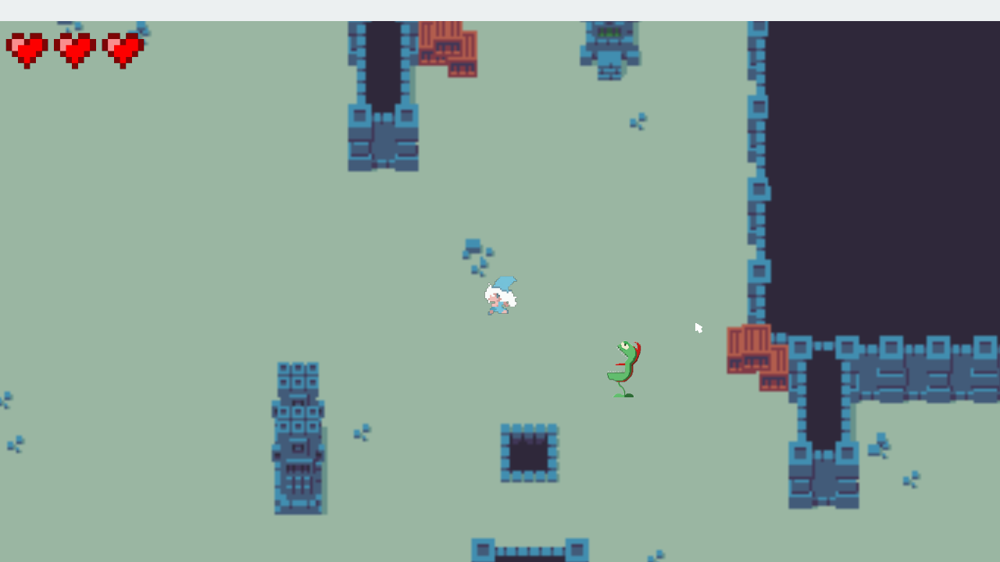
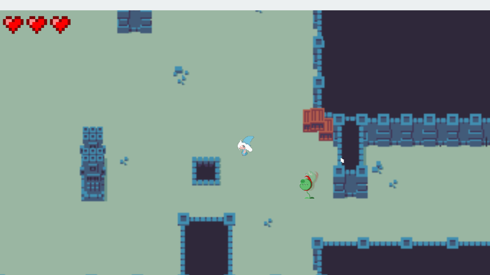


### ...only when you get close to them

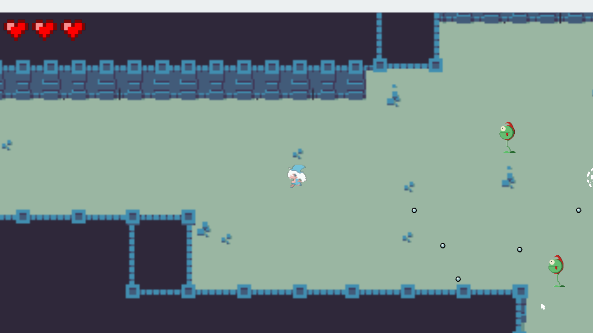


### Life provisions all over the place

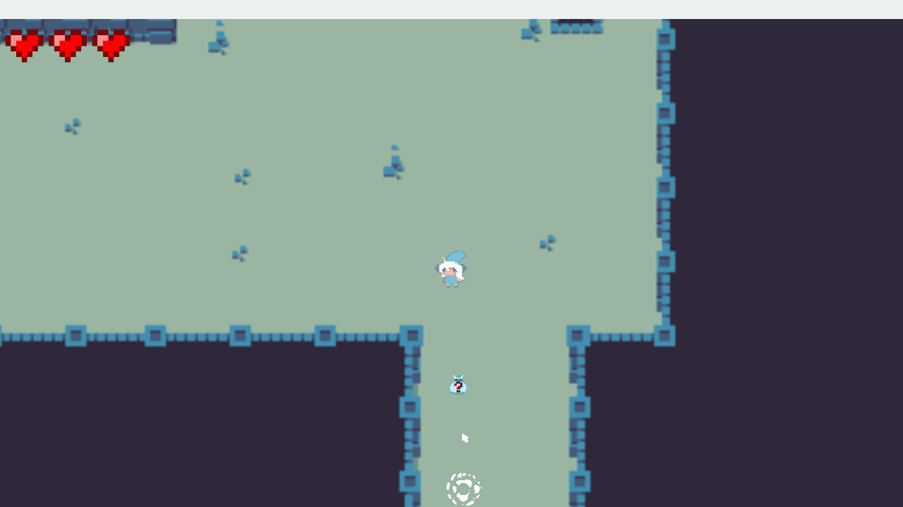
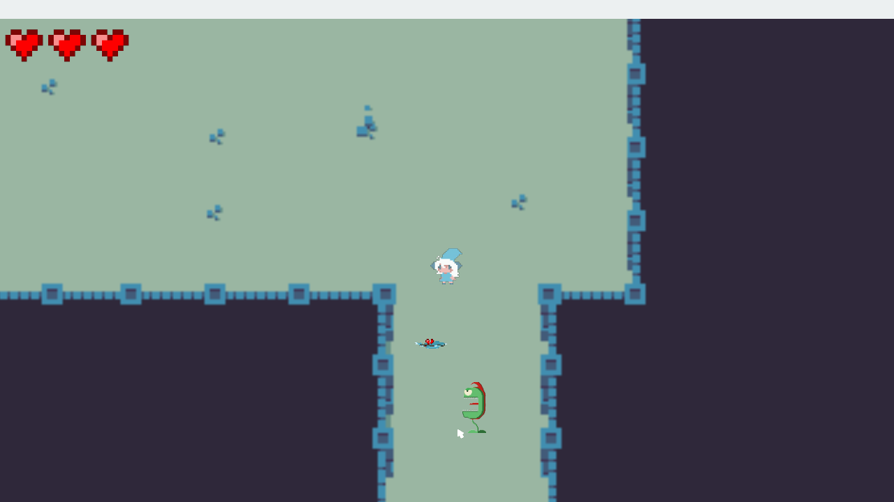
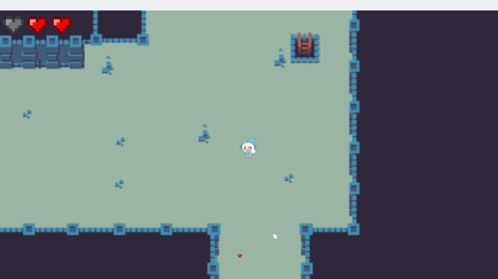

### You got hurt? Visual effects of it and 3 seconds of inmmunity to run away, or do something else... :)

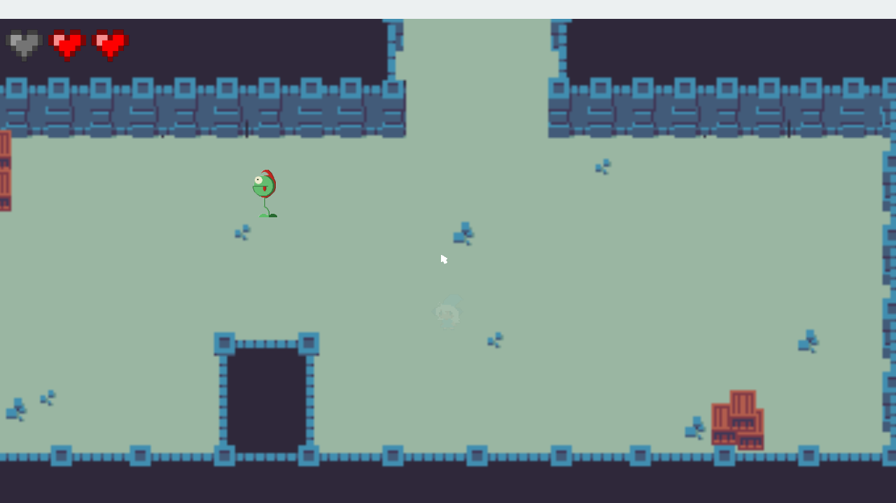

### Don't let them hurt you too much, or terrible things will happen to our little witch :c

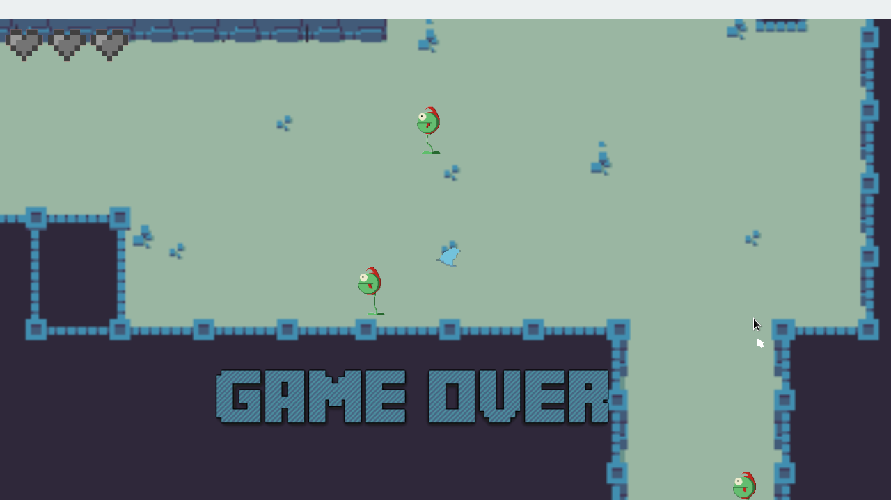
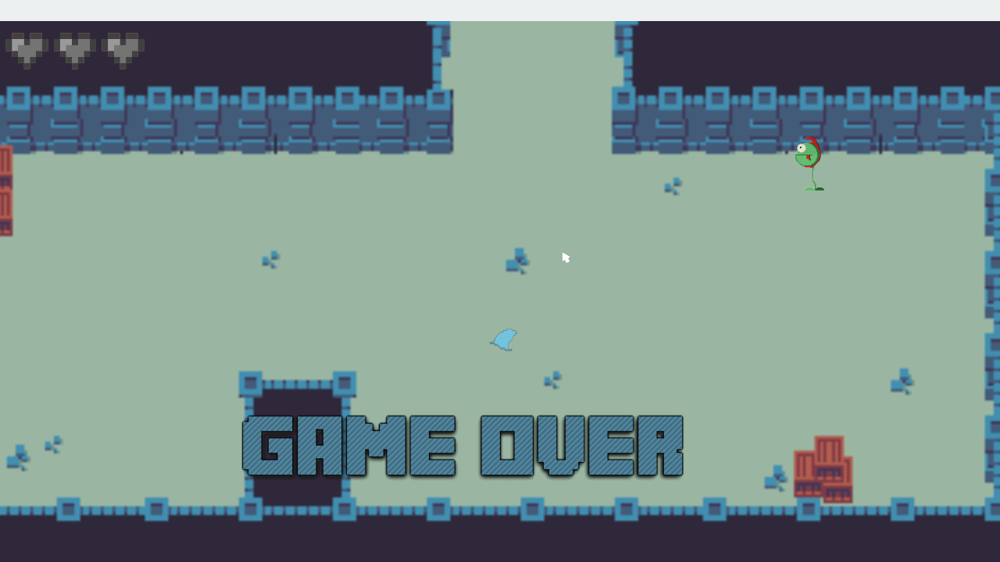
